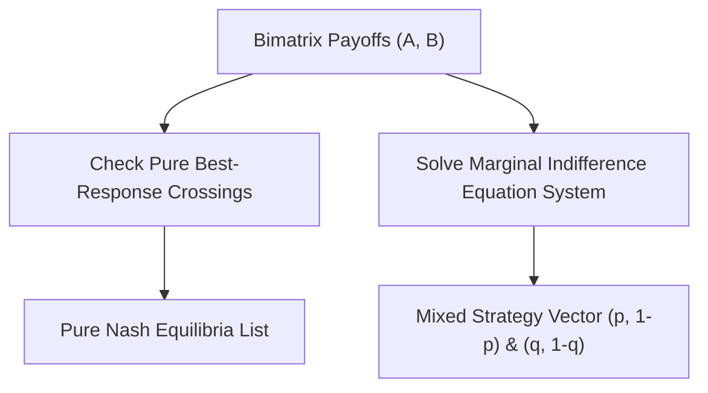

# Nash Equilibrium Bimatrix Solver Skill

Exact solver computing pure and mixed-strategy Nash equilibria in 2-player strategic normal form games.

## Features
- **100% Python Standard Library**: Analytical solving of linear indifference equations.
- **Pure & Mixed Detection**: Simultaneously returns all pure saddle points and mixed solutions.
- **MCP Server Ready**: Direct stdio integration for multi-agent game orchestration.
